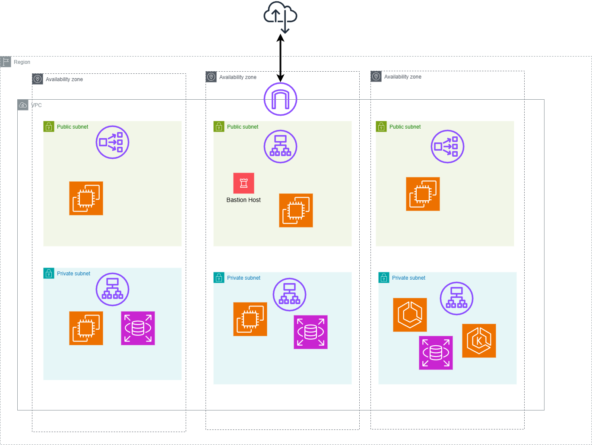

# simple

* 這邊以Terraform VPC module的社群範例，來建置一個比較簡易的VPC與底下的Subnet
    * 可用於一般的三層式架構(Three-tier architecture)
        * 如果有更明確的目的，可以再調整底下的VPC/Subnet CIDR Range/以及是否使用一組或多組Nat Gateway或自建Nat Instance/...etc
* 
* Make some example from Terraform VPC module example: simple
    * 1 region 3 az 
        * 1 vpc
        * 3 private subnet
        * 3 public subnet
        * 1 NAT gateway for all private subnet
        * ...etc

## Quick Start

```shell
$ terraform init
$ terraform plan
$ terraform apply
```

## Docs

* 一些參考的文件，跟使用範例

* [github.com/terraform-aws-modules/terraform-aws-vpc/tree/master/examples/simple](https://github.com/terraform-aws-modules/terraform-aws-vpc/tree/master/examples/simple)
* [hashicorp/aws/latest/docs#authentication-and-configuration](https://registry.terraform.io/providers/hashicorp/aws/latest/docs#authentication-and-configuration)